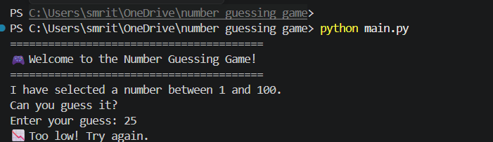
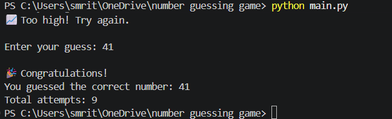

# 🎮 Number Guessing Game

A simple Python console game where the computer randomly selects a number between **1 and 100**, and the player tries to guess it.

## Features

- Random number generation
- Unlimited attempts
- Input validation
- Displays total attempts
- Beginner-friendly project

## Technologies Used

- Python 3
- random module

## How to Run

```bash
python main.py
```

## Sample Output

```
Enter your guess: 50
Too low!

Enter your guess: 75
Too high!

Enter your guess: 63
Congratulations!
```
# 🎮 Number Guessing Game

A simple Python game where the computer randomly selects a number between **1 and 100**, and the player tries to guess it.

## 📸 Screenshot

### Game Start

<p align="center">
  
</p>

### Winning the Game

<p align="center">
  
</p>